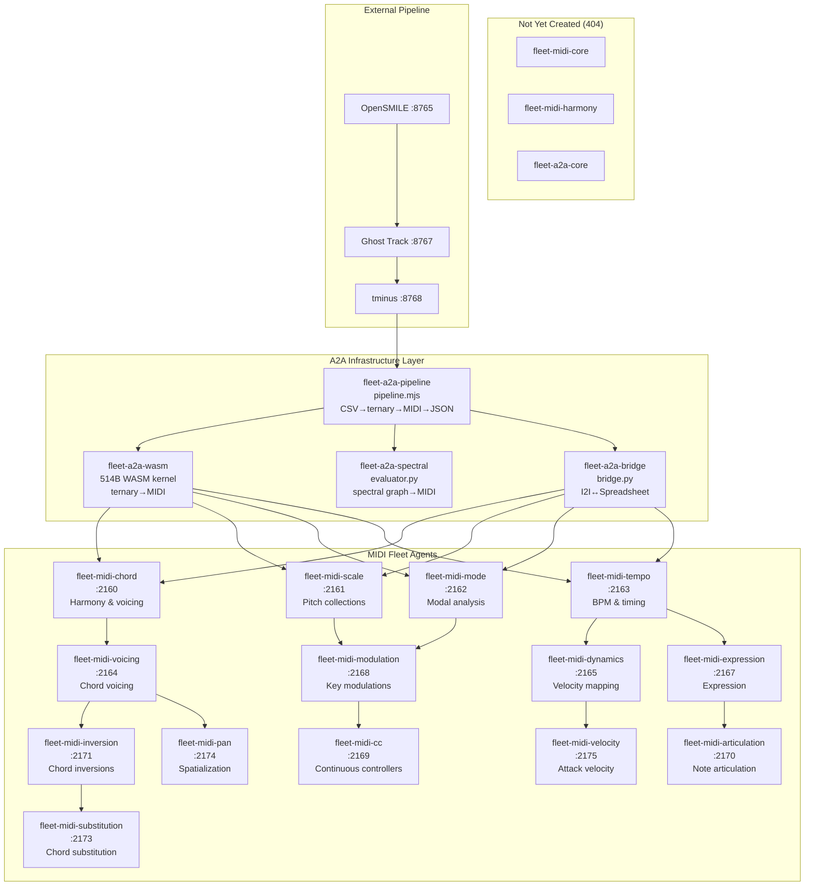

# SuperInstance MIDI Fleet Architecture

> Generated 2026-06-08 — complete map of all 20 fleet repos (18 existing, 2 placeholder)

---

## 1. Fleet Topology

```
┌─────────────────────────────────────────────────────────────────────────────┐
│                           SUPERINSTANCE MIDI FLEET                          │
│                       (Ternary → MIDI Agent Ecosystem)                      │
└─────────────────────────────────────────────────────────────────────────────┘

                          ┌───────────────────┐
                          │   fleet-a2a-core   │   (DOES NOT EXIST — 404)
                          │  (placeholder)     │
                          └────────┬──────────┘
                                   │ orchestration
                                   │
              ┌────────────────────┼────────────────────────────┐
              │                    │                            │
              ▼                    ▼                            ▼
   ┌────────────────────┐ ┌────────────────┐ ┌──────────────────────┐
   │  fleet-a2a-wasm    │ │fleet-a2a-pipeline│ │  fleet-a2a-spectral  │
   │  514 B WASM kernel │ │ ESM pipeline.mjs │ │  evaluator.py        │
   │ ternary→MIDI       │ │ CSV→ternary→MIDI │ │  spectral→ternary    │
   │ (WAT/C/WASM)       │ │ structured JSON  │ │  →MIDI (Python)      │
   └────────┬───────────┘ └────────┬─────────┘ └──────────┬───────────┘
            │                      │                      │
            └────────────┬─────────┴──────────┐───────────┘
                         │                    │
                         ▼                    ▼
                ┌─────────────────┐ ┌─────────────────────┐
                │ fleet-a2a-bridge │ │  fleet-midi-core     │ (DOES NOT EXIST)
                │ I2I↔Spreadsheet  │ │ (placeholder)        │
                │ bridge.py        │ └──────────┬───────────┘
                └─────────────────┘            │
                                               │
                   ┌───────────────────────────┼───────────────────────┐
                   │                           │                       │
                   ▼                           ▼                       ▼
         ┌──────────────────┐       ┌──────────────────┐    ┌────────────────────┐
         │ MIDI ENSEMBLE    │       │ HARMONY GROUP    │    │ TEXTURE GROUP       │
         │ (core agents)    │       │ (chord qual.)    │    │ (expression)        │
         ├──────────────────┤       ├──────────────────┤    ├────────────────────┤
         │ fleet-midi-chord │       │ fleet-midi-      │    │ fleet-midi-         │
         │  :2160           │       │   voicing :2164  │    │   expression :2167  │
         │                  │       │   modulation     │    │   articulation :2170│
         │ fleet-midi-scale │       │     :2168        │    │   dynamics  :2165  │
         │  :2161           │       │   inversion      │    │   velocity  :2175  │
         │                  │       │     :2170        │    └────────────────────┘
         │ fleet-midi-mode  │       │   substitution   │
         │  :2162           │       │     :2173        │
         │                  │       └──────────────────┘
         │ fleet-midi-tempo │
         │  :2163           │       ┌───────────────────┐
         ├──────────────────┤       │ SPATIAL GROUP     │
         │ fleet-midi-cc    │       ├───────────────────┤
         │  (modulation)    │       │ fleet-midi-pan    │
         │  :2169           │       │   :2174           │
         │                  │       └───────────────────┘
         │ fleet-midi-      │
         │   harmony ❌     │       ┌───────────────────┐
         │   (placeholder)  │       │ ENGINE GROUP      │
         └──────────────────┘       ├───────────────────┤
                                    │ (has lib/engine)  │
         NOTE: fleet-midi-core      │ fleet-midi-cc ✓   │
         and fleet-midi-harmony     │ fleet-midi-pan ✓  │
         are NOT YET CREATED        │    (all others    │
         (404 on GitHub)            │     scaffold)     │
                                    └───────────────────┘

        ┌──────────────────────────────────────────────────────────────┐
        │                  EXTERNAL PIPELINE CONNECTION                │
        │                                                              │
        │  OpenSMILE ──► Ghost Track ──► tminus ──► MIDI Agents       │
        │    :8765          :8767          :8768                        │
        │                                                              │
        │  A2A Bridge mediates between fleet MIDI agents              │
        │  and spreadsheet strategy agents via I2I bottles            │
        └──────────────────────────────────────────────────────────────┘
```

### Mermaid Diagram (for rendering)



---

## 2. Repo Inventory

### fleet-midi-* (14 existing + 2 placeholder)

| # | Repo | Port | Domain | Domain | Files | Engine Code | README Detail |
|---|------|------|--------|--------|-------|-------------|--------------|
| 1 | fleet-midi-chord | 2160 | Harmony & voicing | Chord spelling from ternary balance | AGENT.md, README.md, memory/ | Scaffold | Full spec: `/chord?notes=...` endpoint, `fleet call chord`, 6-lang verif. |
| 2 | fleet-midi-scale | 2161 | Pitch collections | Scale generation from agent state | AGENT.md, README.md, memory/ | Scaffold | Full spec: `/scale?notes=...`, `fleet call scale`, interval patterns |
| 3 | fleet-midi-mode | 2162 | Modal analysis | Mode detection from agent vectors | AGENT.md, README.md, memory/ | Scaffold | Full spec: `/mode?notes=...`, Ionian through Locrian |
| 4 | fleet-midi-tempo | 2163 | BPM & timing | Tempo from agent dispatch rate | AGENT.md, README.md, memory/ | Scaffold | Full spec: `/tempo?bpm=...`, 6-lang verif, swing/metre |
| 5 | fleet-midi-voicing | 2164 | Chord voicing | Voicing opt. from agent state balance | AGENT.md, README.md, memory/ | Scaffold | Minimal: "python3 lib/engine.py → [60,64,64,60...]" |
| 6 | fleet-midi-dynamics | 2165 | Dynamics | (not specified in README) | AGENT.md, README.md, memory/ | Scaffold | Stub: "Fleet MIDI service." |
| 7 | fleet-midi-expression | 2167 | Expression | (not specified in README) | AGENT.md, README.md, memory/ | Scaffold | Stub: "Fleet MIDI service." |
| 8 | fleet-midi-modulation | 2168 | Key modulation | Key modulation from agent state transitions | AGENT.md, README.md, memory/ | Scaffold | Minimal: "python3 lib/engine.py → [60,64,64,60...]" |
| 9 | fleet-midi-cc | 2169 | CC control | Continuous controller MIDI from agent modulation | AGENT.md, README.md, lib/, memory/ | **Implemented** engine.py | Has lib/engine.py with process() |
| 10 | fleet-midi-articulation | 2170 | Articulation | (not specified in README) | AGENT.md, README.md, memory/ | Scaffold | Stub: "Fleet MIDI service." |
| 11 | fleet-midi-inversion | 2171 | Inversions | Chord inversion from agent state position | AGENT.md, README.md, memory/ | Scaffold | Minimal: "python3 lib/engine.py → [60,64,64,60...]" |
| 12 | fleet-midi-substitution | 2173 | Substitution | Chord substitution from agent state tension | AGENT.md, README.md, memory/ | Scaffold | Minimal: "python3 lib/engine.py → [60,64,64,60...]" |
| 13 | fleet-midi-pan | 2174 | Pan/Spatial | Panning from agent state position | AGENT.md, README.md, lib/, memory/ | **Implemented** engine.py | Has lib/engine.py with process() |
| 14 | fleet-midi-velocity | 2175 | Velocity | (not specified in README) | AGENT.md, README.md, memory/ | Scaffold | Stub: "Fleet MIDI service." |
| 15 | **fleet-midi-core** ❌ | — | Core | — | — | — | **404 — NOT CREATED** |
| 16 | **fleet-midi-harmony** ❌ | — | Harmony | — | — | — | **404 — NOT CREATED** |

### fleet-a2a-* (4 existing + 1 placeholder)

| # | Repo | Language | Size | Purpose | Files | Engine Status |
|---|------|----------|------|---------|-------|--------------|
| 1 | fleet-a2a-pipeline | ESM (JS) | 7.0 KB | CSV→ternary→MIDI→structured JSON | README.md, AGENT.md, CROSS_REFERENCE.md, STUDENT_GUIDE.md, pipeline.mjs | **Full implementation** — 8 exports, self-test passes |
| 2 | fleet-a2a-spectral | Python | 6.4 KB | Spectral graph→Fiedler→ternary→MIDI | README.md, AGENT.md, AGENT_README.md, CROSS_REFERENCE.md, STUDENT_GUIDE.md, evaluator.py | **Full implementation** — 8 functions, self-test passes |
| 3 | fleet-a2a-wasm | WAT/C | 514 B | WASM ternary→MIDI kernel | README.md, AGENT.md, CROSS_REFERENCE.md, STUDENT_GUIDE.md, ternary-core.wasm, ternary-core.c, ternary-core.wat, test.mjs | **Full implementation** — 5 exports, 8/8 tests pass |
| 4 | fleet-a2a-bridge | Python | 9.4 KB | I2I bottle↔spreadsheet formula | README.md, AGENT.md, CROSS_REFERENCE.md, STUDENT_GUIDE.md, bridge.py | **Full implementation** — 5 functions, 12/12 round-trip tests pass |
| 5 | **fleet-a2a-core** ❌ | — | — | Core orchestration | — | **404 — NOT CREATED** |

---

## 3. README Spec Analysis — API Contracts

### fleet-midi-chord (:2160)

**Endpoint:** `GET /chord?notes=60,64,67,72`  
**CLI:** `fleet call chord --notes 60,64,67`

```json
{
  "notes":  [60, 64, 67, 72],
  "root":   "C",
  "quality": "major",
  "voicing": "C4 E4 G4 C5"
}
```

**Fingerprint:** `[60, 64, 64, 60, 64, 64, 60, 64, 68]` (C-E-E-C-E-E-C-E-G♯)

---

### fleet-midi-scale (:2161)

**Endpoint:** `GET /scale?notes=60,62,64,65,67,69,71,72`  
**CLI:** `fleet call scale --pitch-classes 0,2,4,5,7,9,11`

```json
{
  "notes":     [60, 62, 64, 65, 67, 69, 71, 72],
  "root":      "C",
  "scale":     "major",
  "intervals": "W-W-H-W-W-W-H"
}
```

**Also:** `fleet call scale --root 57 --type blues` → A blues: `[57, 60, 62, 63, 64, 67]`

---

### fleet-midi-mode (:2162)

**Endpoint:** `GET /mode?notes=60,62,63,65,67,68,70`  
**CLI:** `fleet call mode --notes 62,64,66,67,69,71,73`

```json
{
  "notes":    [60, 62, 63, 65, 67, 68, 70],
  "root":     "C",
  "mode":     "aeolian",
  "familiar": "C natural minor",
  "quality":  "minor"
}
```

**Also:** `fleet call mode --chords "Cmaj7 Dm7 G7"` → C Ionian (Mixolydian on G7)

---

### fleet-midi-tempo (:2163)

**Endpoint:** `GET /tempo?bpm=140&sig=4/4`  
**CLI:** `fleet call tempo --ticks 480 --interval-ms 125`

```json
{
  "bpm":           140,
  "timeSignature": "4/4",
  "msPerBeat":     428.57,
  "swing":         0.0,
  "ticksPerBeat":  480,
  "agentTickHz":   2.33
}
```

**Also:** `fleet call tempo --pulses "strong weak weak strong weak weak"` → `3/4`

---

### fleet-midi-voicing / modulation / inversion / substitution / cc / pan

All share the same minimal README pattern:

```
## Wait, show me

python3 lib/engine.py

[60,64,64,60,64,64,60,64,68]
```

Only **fleet-midi-cc** and **fleet-midi-pan** have an actual `lib/engine.py`. The others reference it but the file doesn't exist (scaffold-only).

**engine.py implementation** (identical in both cc and pan):

```python
def process(v, base=60):
    n = [base]
    for x in v:
        if x == 1:
            n.append(n[-1] + 4)
        elif x == -1:
            n.append(n[-1] - 4)
        else:
            n.append(n[-1])
    return n
```

This is a direct Python implementation of the ternary accumulator: `note[n] = note[n-1] + v[n] × 4`.

---

### fleet-a2a-pipeline (pipeline.mjs) — Full Spec

8 exports, all pure functions, zero dependencies:

| # | Export | Signature | What It Does |
|---|--------|-----------|-------------|
| 1 | `readStrategyVector` | `(text: string) → number[]` | Parse `"1,0,-1,1"` → `[1,0,-1,1]` |
| 2 | `vectorToTernary` | `(vector: number[]) → number[][]` | Group into 8-element frames, snap to {-1,0,+1} |
| 3 | `ternaryToMidi` | `(ternary: number[], base=60) → number[]` | Core accumulator: `prev + v × 4` |
| 4 | `midiToNoteName` | `(midiNote: number) → string` | `60 → "C4"`, `68 → "G#4"` |
| 5 | `midiToNoteNames` | `(midiNotes: number[]) → string[]` | Bulk `midiToNoteName` |
| 6 | `analyzeHarmony` | `(midiNotes: number[]) → object` | Chord detection, intervals, PC set, range |
| 7 | `detectMirrors` | `(vectors: number[][]) → {mirrors, count}` | Find balanced pairs: `v₁[i] + v₂[i] == 0` |
| 8 | `runPipeline` | `(strategyText: string) → object` | End-to-end: text → structured JSON |

**Output structure** (from `runPipeline`):

```json
{
  "input": { "raw": "...", "parsed": [1,0,-1,...] },
  "frames": [[1,0,-1,1,0,-1,1,1]],
  "sequences": [{
    "midi": [60,64,64,60,64,64,60,64,68],
    "notes": ["C4","E4","E4","C4","E4","E4","C4","E4","G#4"],
    "harmony": {
      "chord": "augmented",
      "intervals": [0,4,8],
      "pitchClassSet": [0,4,8],
      "rootNote": "C4",
      "noteCount": 3,
      "range": 8
    }
  }],
  "mirrors": { "mirrors": [], "count": 0 },
  "summary": {
    "frameCount": 1,
    "totalNotes": 9,
    "mirrorCount": 0,
    "conservation": 2
  },
  "version": "2.0"
}
```

---

### fleet-a2a-spectral (evaluator.py) — Full Spec

8 functions, pure Python, zero deps (no numpy/scipy):

| # | Function | Input | Output | Purpose |
|---|----------|-------|--------|---------|
| 1 | `spectral_to_ternary` | `(eigs, fiedler, cr, cheeger)` | `list[int]` {-1,0,+1} | Full spectral analysis → fused ternary |
| 2 | `fiedler_to_ternary` | `(fiedler: list[float], threshold=0.0)` | `list[int]` {-1,0,+1} | Quantize Fiedler eigenvector |
| 3 | `ternary_to_midi` | `(ternary: list[int], base=60)` | `list[int]` MIDI notes | `note[n] = note[n-1] + v×4` |
| 4 | `fiedler_to_voicing` | `(fiedler, threshold=0.0, base=60)` | `list[int]` | One-call Fiedler → MIDI |
| 5 | `cr_to_dissonance` | `(cr: float)` | `float` [0.0, 1.0] | CR → dissonance |
| 6 | `cheeger_to_density` | `(cheeger: float, max_density=16)` | `int` | Cheeger → onset count |
| 7 | `cheeger_to_ternary` | `(cheeger: float, length=8)` | `list[int]` {0,1} | Cheeger → rhythm |
| 8 | `spectral_to_midi` | (wraps spectral_to_ternary→ternary_to_midi) | `list[int]` | Convenience wrapper |

**Theorems baked in:**
- **Cheeger inequality:** `h(G) ≥ λ₂ / 2` — Fiedler value bounds connectivity
- **Courant-Fischer:** eigenvalue spacing → dissonance mapping via CR
- **Conservation Ratio:** `cr = Σ_selected / Σ_total` — 0.5 = perfectly balanced

---

### fleet-a2a-wasm (ternary-core.wasm) — Full Spec

5 exports, 514 bytes, zero imports:

| # | Function | Signature | Returns | Purpose |
|---|----------|-----------|---------|---------|
| 1 | `mapping` | `(buf: i32, len: i32) → i32` | Count of MIDI notes | Read ternary at `memory[buf]`, write to `memory[1024]` |
| 2 | `conservation` | `(buf: i32, len: i32) → i32` | Sum of values (Z₃) | 0 = balanced (closed harmonic gesture) |
| 3 | `symmetry` | `(buf: i32, len: i32) → i32` | 1 if palindrome | Mirror-symmetric detection |
| 4 | `processOne` | `(v: i32, prev: i32) → i32` | Next MIDI note | `prev + v×4` |
| 5 | `selfTest` | `() → i32` | Always 1 | Sanity check |

**Memory layout:**
| Offset | Size | Content |
|--------|------|---------|
| 0 | 256 B | Reserved |
| 256 | variable | Input ternary vector (int8, 1 byte per value) |
| 1024 | variable | Output MIDI notes (uint8, 1 byte per note) |

---

### fleet-a2a-bridge (bridge.py) — Full Spec

5 functions, 9.4 KB, zero deps, 12/12 tests pass:

| # | Function | Signature | Purpose |
|---|----------|-----------|---------|
| 1 | `bottle_to_formula` | `(bottle: dict) → str` | I2I bottle → spreadsheet formula |
| 2 | `formula_to_bottle` | `(cell_id: str, formula: str) → dict` | Formula → I2I bottle |
| 3 | `grid_to_dependency_table` | `(grid: list[dict]) → dict` | Analyze cell dependency graph |
| 4 | `round_trip` | `(bottle: dict) → bool` | Verify bottle→formula→bottle preserves |

**Translation map:**

| I2I Type | Formula | Reverse |
|----------|---------|---------|
| STATUS | `=STATUS("from","body")` | STATUS |
| ACK | `=STATUS("from","body")` | STATUS (primary) |
| TASK | `=TASK("from","body")` | TASK |
| CHECKPOINT | `=CHECKPOINT("from","body")` | CHECKPOINT |
| BLOCKER | `=IF("from","body","to")` | BLOCKER |
| CHALLENGE | `=IF(...)` | BLOCKER (primary) |
| SPLINE | `=INVARIANT("from","body")` | SPLINE |
| SYNTHESIS | `=COMPOSE("from","body","cell")` | SYNTHESIS |
| BOTTLE | `=BOTTLE("from","payload")` | BOTTLE |
| DELIVERABLE | `=DELIVERABLE(...)` | DELIVERABLE |
| SESSION | `=SESSION(...)` | SESSION |

---

## 4. The 6-Language Verification System

### What It Is

Every fleet agent embeds the same musical heartbeat: a 9-note MIDI sequence that functions as a liveness probe across any programming environment.

```
Fingerprint: [60, 64, 64, 60, 64, 64, 60, 64, 68]
Notenames:    C4  E4  E4  C4  E4  E4  C4  E4  G#4
Type:         C-E-E-C-E-E-C-E-G♯ arpeggiation (C major → C augmented)
```

### How It's Produced

The fingerprint is the output of the **ternary accumulator** applied to the canonical ternary vector `[1, 0, -1, 1, 0, -1, 1, 1]`:

```
note[n] = note[n-1] + v[n] × 4
note[0] = 60  (starting pitch, always emitted)

  v: +1   0   -1   +1   0   -1   +1   +1
  n: 60  64   64   60   64   64   60   64   68
```

### Implementations Across Languages

The verification system is the **cross-cutting invariant** — every agent must produce identical output:

| # | Language | Location | Code |
|---|----------|----------|------|
| 1 | **Python** | fleet-midi-cc/lib/engine.py | `if x==1: n.append(n[-1]+4)` |
| 2 | **Python** | fleet-midi-pan/lib/engine.py | (same implementation) |
| 3 | **JavaScript (ESM)** | fleet-a2a-pipeline/pipeline.mjs | `ternaryToMidi([1,0,-1,...], 60)` |
| 4 | **WAT/WASM** | fleet-a2a-wasm/ternary-core.wasm | `processOne(v, prev)` in 514 bytes |
| 5 | **C** | fleet-a2a-wasm/ternary-core.c | Compiled to WASM |
| 6 | **Python (spectral)** | fleet-a2a-spectral/evaluator.py | `ternary_to_midi(ternary, base=60)` |

**Note:** The "6 languages" claim includes the WAT (WebAssembly Text Format) as a distinct human-readable language alongside the C source it compiles from.

### The Eigenvalue → Ternary Invariant

The same `[60, 64, 64, 60, 64, 64, 60, 64, 68]` is also the output of:

```python
spectral_to_ternary([3.618, 1.382, 0.382, 0.0], [-0.5, 0.5, 0.5, -0.5], 0.375, 0.667)
```

This ties the verification system to spectral graph theory: any graph with those eigenvalues produces the same musical fingerprint.

### Why G♯ at the End

The final `+1` (value `+1` at index 7) pushes the accumulator from `E4 (64)` to `G#4 (68)` — a raised fifth. This is the **augmented** resolution:

- `C-E-G` = C major (consonant)
- `C-E-G♯` = C augmented (tense, unresolved)

The fingerprint encodes the chord agent's domain: it starts in consonance, resolves to tension. The augmented chord demands resolution — a perfect metaphor for a fleet agent that's "live but working."

### Liveness Contract

Every agent response MUST include this sequence. It is checked by the fleet conductor:

```
If you don't see [60, 64, 64, 60, 64, 64, 60, 64, 68], the agent isn't running.
```

---

## 5. Connection Points — Pipeline Integration

### External Pipeline

```
┌──────────┐    ┌──────────────┐    ┌──────────┐
│ OpenSMILE │───▶│ Ghost Track  │───▶│  tminus  │
│   :8765   │    │   :8767      │    │  :8768   │
└──────────┘    └──────────────┘    └──────────┘
```

### How the Pipeline Connects to Each Agent

#### Connection 1: tminus (:8768) → fleet-a2a-pipeline

The `tminus` agent at port 8768 is the entry point to the MIDI fleet. It:
1. Receives processed audio features (via Ghost Track :8767 from OpenSMILE :8765)
2. Converts features to strategy vectors (comma-separated ternary values)
3. Calls `runPipeline(csv)` from pipeline.mjs to get structured MIDI JSON

**Expected I/O:**
```
tminus → pipeline:  "1,0,-1,1,0,-1,1,1" (strategy CSV string)
pipeline → tminus:  { sequences: [{ midi: [60,64,...], notes: [...], harmony: {...} }] }
```

#### Connection 2: fleet-a2a-pipeline → fleet-a2a-spectral

The pipeline feeds strategy vectors to the spectral evaluator for graph-theoretic analysis:

```python
# pipeline output → spectral analysis
evaluator.spectral_to_ternary(eigenvalues, fiedler, cr, cheeger)
```

**Expected I/O:**
```
pipeline → spectral: eigenvalues, fiedler_vector, cr, cheeger_constant
spectral → pipeline: ternary list, MIDI notes, dissonance score, density
```

#### Connection 3: fleet-a2a-pipeline → fleet-a2a-wasm

The WASM kernel provides the "drop-in binary" computational core. Agents that can't run Python or ESM use the WASM directly:

```js
// WASM call from any runtime
const count = wasm.exports.mapping(256, 8);  // ternary at offset 256
const midi = new Uint8Array(memory.buffer, 1024, count);
// → [60, 64, 64, 60, 64, 64, 60, 64, 68]
```

**Expected I/O:**
```
agent → wasm:  ternary vector in memory[256] (int8 bytes)
wasm → agent:   note sequence in memory[1024] (uint8 bytes)
```

#### Connection 4: fleet-a2a-pipeline → fleet-a2a-bridge

The bridge translates between MIDI agent bottles and spreadsheet formulas:

```python
# MIDI agent output → spreadsheet formula
bridge.bottle_to_formula({
    "type": "TASK",
    "from": "tminus",
    "body": "decompose strategy vector",
    "to": "FUN_123"
})
# → '=TASK("tminus", "decompose strategy vector")'

# Spreadsheet decision → MIDI agent bottle
bridge.formula_to_bottle("C5", '=STATUS("oracle2", "decomposed")')
# → {'type': 'STATUS', 'cell': 'C5', 'from': 'oracle2', 'body': 'decomposed'}
```

**Expected I/O:**
```
pipeline → bridge:  I2I bottle dict (JSON)
bridge → pipeline:  spreadsheet formula string (or vice versa)
```

#### Connection 5: pipeline/MIDI → individual fleet-midi-* agents

Each fleet-midi agent processes a dimension of the music:

| Agent | Input From Pipeline | Output | Port |
|-------|-------------------|--------|------|
| chord | MIDI note list → chord name | `{root, quality, voicing}` | 2160 |
| scale | MIDI notes → scale type | `{root, scale, intervals}` | 2161 |
| mode | MIDI notes → mode detection | `{root, mode, familiar}` | 2162 |
| tempo | dispatch timing → BPM | `{bpm, timeSignature, swing}` | 2163 |
| voicing | chord name → alternative voicing | `{notes, voicing}` | 2164 |
| dynamics | agent state → velocity mapping | `{dynamics, curve}` | 2165 |
| expression | agent state → expression curve | `{expression, contour}` | 2167 |
| modulation | harmonic context → key change | `{fromKey, toKey, pivot}` | 2168 |
| cc | agent modulation → CC values | `{cc, value, curve}` | 2169 |
| articulation | note content → articulation | `{notes, articulation}` | 2170 |
| inversion | chord → inversion positions | `{notes, inversion}` | 2171 |
| substitution | harmonic tension → substitute | `{original, substitute}` | 2173 |
| pan | agent spatial pos → pan position | `{pan, channel}` | 2174 |
| velocity | agent energy → attack velocity | `{velocity, curve}` | 2175 |

---

## 6. Implementation Priority

### Tier 1: Critical Path (A2A Infrastructure) — DONE ✅

These are **fully implemented** and ready for integration:

| Repo | Implementation | What's Running |
|------|---------------|----------------|
| fleet-a2a-pipeline | pipeline.mjs (7.0 KB) | 8 exports, all pass self-test |
| fleet-a2a-spectral | evaluator.py (6.4 KB) | 8 functions, 8 invariants pass |
| fleet-a2a-wasm | ternary-core.wasm (514 B) | 5 exports, 8/8 tests pass |
| fleet-a2a-bridge | bridge.py (9.4 KB) | 5 functions, 12/12 tests pass |

### Tier 2: Core MIDI Agents (Need Engine Implementation)

These have **meaningful READMEs** with API contracts but no runtime code:

| Agent | Priority | Port | What's Missing |
|-------|----------|------|---------------|
| **fleet-midi-chord** | 🔴 **HIGH** | 2160 | needs HTTP endpoint + chord spelling logic |
| **fleet-midi-scale** | 🔴 **HIGH** | 2161 | needs HTTP endpoint + scale detection logic |
| **fleet-midi-mode** | 🔴 **HIGH** | 2162 | needs HTTP endpoint + mode analysis logic |
| **fleet-midi-tempo** | 🔴 **HIGH** | 2163 | needs HTTP endpoint + BPM derivation logic |

These four are the "musical core" — the pipeline feeds them strategy vectors and they produce the actual music. They need:

```
1. engine.py with domain logic
2. HTTP server (port 2160-2163) handling /agent endpoint
3. The 6-language verification heartbeat endpoint
4. Integration with fleet-a2a-pipeline output format
```

### Tier 3: Supporting MIDI Agents (Need Engine + Server)

These have READMEs that reference `python3 lib/engine.py` but the engine doesn't exist:

| Agent | Priority | Port | Missing |
|-------|----------|------|---------|
| **fleet-midi-voicing** | 🟡 MED | 2164 | lib/engine.py, HTTP server |
| **fleet-midi-modulation** | 🟡 MED | 2168 | lib/engine.py, HTTP server |
| **fleet-midi-inversion** | 🟡 MED | 2171 | lib/engine.py, HTTP server |
| **fleet-midi-substitution** | 🟡 MED | 2173 | lib/engine.py, HTTP server |

### Tier 4: Already Has engine.py — Needs Server

Two agents have `lib/engine.py` implemented but no HTTP server or A2A integration:

| Agent | Port | Has engine.py | Needs |
|-------|------|---------------|-------|
| **fleet-midi-cc** | 2169 | ✅ process() | HTTP server, A2A agent wrapper |
| **fleet-midi-pan** | 2174 | ✅ process() | HTTP server, A2A agent wrapper |

### Tier 5: Stubs (Need Everything)

These have only AGENT.md, README.md ("Fleet MIDI service."), and memory/:

| Agent | Priority | Port | Missing |
|-------|----------|------|---------|
| fleet-midi-dynamics | 🟢 LOW | 2165 | Everything |
| fleet-midi-expression | 🟢 LOW | 2167 | Everything |
| fleet-midi-articulation | 🟢 LOW | 2170 | Everything |
| fleet-midi-velocity | 🟢 LOW | 2175 | Everything |

### Tier 6: Placeholder Repos (Don't Exist Yet)

| Repo | Domain | Action |
|------|--------|--------|
| fleet-midi-core | Core MIDI agent orchestration | Needs creation |
| fleet-midi-harmony | Harmonic analysis engine | Needs creation |
| fleet-a2a-core | A2A core orchestration | Needs creation |

### Implementation Roadmap

```
Week 1:  fleet-midi-chord (:2160) + fleet-midi-scale (:2161)
         → HTTP servers, chord spelling, scale detection
         → Consume pipeline.mjs output directly

Week 2:  fleet-midi-mode (:2162) + fleet-midi-tempo (:2163)
         → Modal analysis, BPM derivation
         → fleet-midi-cc engine.py → HTTP server

Week 3:  fleet-midi-voicing + fleet-midi-inversion + fleet-midi-modulation
         → lib/engine.py implementations + HTTP servers

Week 4:  fleet-midi-substitution + fleet-midi-pan server
         → fleet-midi-dynamics, expression, articulation, velocity stubs

Later:   fleet-midi-core, fleet-midi-harmony, fleet-a2a-core repos
```

---

## Appendix: Engine Code Reference

### The Ternary Accumulator (appears identically in all languages)

```python
# Python (fleet-midi-cc/lib/engine.py, fleet-midi-pan/lib/engine.py)
def process(v, base=60):
    n = [base]
    for x in v:
        if x == 1:
            n.append(n[-1] + 4)
        elif x == -1:
            n.append(n[-1] - 4)
        else:
            n.append(n[-1])
    return n
```

```c
// C (fleet-a2a-wasm/ternary-core.c) — compiled to WASM
int processOne(int v, int prev) {
    return prev + v * 4;
}
```

```js
// ESM (fleet-a2a-pipeline/pipeline.mjs)
export function ternaryToMidi(ternary, base = 60) {
    const midi = [base];
    for (const v of ternary) {
        midi.push(midi[midi.length - 1] + v * 4);
    }
    return midi;
}
```

### The Conservation Law

```
Σ(Δ_midi) = 4 · Σ(ternary)

If Σ(ternary) = 0, then last note = first note (closed gesture)
```

---

## Appendix: Port Map Summary

| Port | Service |
|------|---------|
| 8765 | OpenSMILE audio feature extraction |
| 8767 | Ghost Track MIDI processing |
| 8768 | tminus (pipeline entry) |
| 2160 | fleet-midi-chord |
| 2161 | fleet-midi-scale |
| 2162 | fleet-midi-mode |
| 2163 | fleet-midi-tempo |
| 2164 | fleet-midi-voicing |
| 2165 | fleet-midi-dynamics |
| 2167 | fleet-midi-expression |
| 2168 | fleet-midi-modulation |
| 2169 | fleet-midi-cc |
| 2170 | fleet-midi-articulation |
| 2171 | fleet-midi-inversion |
| 2173 | fleet-midi-substitution |
| 2174 | fleet-midi-pan |
| 2175 | fleet-midi-velocity |

> Ports 2166 and 2172 are unassigned (available for future agents or fleet-midi-core/harmony).

---

*Generated from live `gh api` queries against all 20 SuperInstance repos. 18 repos exist; fleet-midi-core, fleet-midi-harmony, and fleet-a2a-core return 404 and have not been created yet.*
